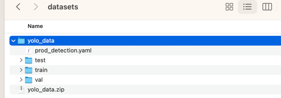

# AICity-Prod-Counting-2023
This repo contains the code which is part of submission by team Centific for Track-4 AI City Challenge, 2023.

There are 4 major sections in this markdown
1. [Environment Creation](#environment-creation)
2. [Data Preparation](#data-preparation)
3. [Model Training](#model-training)
4. [Inference](#inference)

If you want to replicate the leaderboard submission/inference on new test set, create an environment as per instructions 
in [Environment Creation](#environment-creation) and follow instructions in [Inference](#inference).

In order to replicate our training results, create an environment as per instructions in
[Environment Creation](#environment-creation) and then head directly to [Direct Training](#direct-training)

If you want to understand and test the code validity of the whole process, run through all the sections in order.

For any other steps, look at the relevant section.

## Environment creation
In order to create an environment to execute all the codes, run the commands below

#### Create a virtual environment
The below command will create a conda environment

```bash
conda create -n aicity python=3.8
```

#### Activate the environment
The command below will activate the created environment in above step
```bash
conda activate aicity
```

### Install the packages
The command below will install the packages listed in the **requirements.txt** in the activated environment

```bash
pip install -r requirements.txt
```

## Data Preparation
The process of data preparation contains two major steps
1. Creation of Object Detection Dataset
2. Creation of dataset for Yolov5 training 


### Creation of Object Detection Dataset
As part of the AI City challenge, we received a dataset which contains product images and 
segmentation masks as shown below


We have developed a code to use these product images and segmentation masks and create 
an object detection dataset.

For every image in object detection dataset, a background image is required. This is sampled from
sample from 3 backgrounds from this [folder](./backgrounds)

In order to generate the object detection dataset, execute the command below
```bash
python src/data_prep/create_synth_detection_data.py --data_dir <data_dir> --background_path ./backgrounds --out_dir <out_dir> --dontocclude
```
There are 4 arguments that are needed to run the above script. 
Details of arguments are given below
1. **data_dir** - The directory which has the raw data. This directory should contain two folders named **train** and **segmentation_labels** and file named **label.txt** as shown below


2. **background_path** - This directory should contain the background files that need to be used
3. **out_dir** - The path where object detection dataset would be saved
4. **dontocclude** - This argument will ensure to paste products on the background so that they are not fully occluded

After executing the code, you will see the following folders & files  in the **out_dir**


### Creation of dataset for Yolov5 training
After the objection detection dataset is created as per the above step, We 
need to prepare the data in a folder structure which is compatible for Yolov5 training.
This section explains the steps for the same.

To prepare the data which is ready for Yolov5 custom training, execute the command below
```bash
python src/data_prep/create_yolo_data_folders.py --input_dir <input_dir> --output_dir <output_dir> \
                                                        --train_ratio 0.7 --valid_ratio 0.15 --test_ratio 0.15
```
Few arguments are hardcoded in the above command. Those were the data preparation parameters we used.

There are 5 arguments that are needed to run the above script. 
Details of arguments are given below
1. **input_dir** - The folder path which contains the object detection data. This will be the 
output of the previous step (Creation of Object Detection Dataset)


2. **output_dir** - The folder path where files would be saved as per yolov5 structure
3. **train_ratio** - Percentage of data to be used for training. We used 0.7 for our training
4. **valid_ratio** - Percentage of data to be used for validation. We used 0.15 for our training
5. **test_ratio** - Percentage of data to be used for test. We used 0.15 for our training

After executing the code, you will see the following folders & files in the **output_dir**


The folder path **output_dir** in this step will be used for yolov5 custom model training. 

## Model Training
If you want to replicate our training results, follow [Direct Training](#direct-training) section

If you are testing the whole code process and ran the all the steps in sequence, follow [Train Model](#train-model)

### Direct Training
If you want to directly run training process, download the yolo_data from
[link](https://drive.google.com/file/d/1Vsn0Og-cpM-cPp1ptBrWHmbwBUdwcNoO/view?usp=sharing) 
and place the file in **datasets** folder.

Unzip the file **yolo_data.zip** and after that the folder should look like below



In order to execute the code, first you need to cd to yolov5 directory using the command below

```bash
cd yolov5
```

Trigger the training job by executing the command below
```bash
python train.py --img 640 --batch-size 16 --weights yolov5m.pt --epochs 70 \
                --device 0 --name aicity --input_dir ../datasets/yolo_data
```
**_Pass the argument for device as 0 if you have GPU else use cpu**_

After executing the code, you will be able to view the results inside yolov5 folder as shown below


The best model would be available in the **weights folder** saved as **best.pt**

### Train Model
After yolov5 dataset structure is created as per step 
[Creation of dataset for Yolov5 training](#creation-of-dataset-for-yolov5-training), We can trigger model training using the 
code below

First, you need to cd to yolov5 directory using the command below

```bash
cd yolov5
```

Trigger the training job by executing the command below
```bash
python train.py --img 640 --batch-size 16 --weights yolov5m.pt --epochs 70 \
                --device cpu --name aicity --input_dir <input_dir>
```
Few arguments are hardcoded in the above command. Those were our final model training parameters.

There are 7 arguments that are needed to run the above script. 
Details of arguments are given below
1. **img** - Image size
2. **batch_size** - batch size
3. **weights** - pretrained Model weights
4. **epochs** - Number of epochs for training
5. **device** - use cpu if the machine on which you run doesn't have a GPU, else use 0
6. **name** - name of the project
7. **input_dir** - Folder path of the input directory which contains data in structure required 
by Yolov5 as shown below
This will be the output of the previous step (Creation of dataset for Yolov5 training) 


After executing the code, you will be able to view the results inside yolov5 folder as shown below


The best model would be available in the **weights folder** saved as **best.pt**

## Inference
In order to replicate the leaderboard performance for test set A, execute the code as shown below

```bash
python src/inference/create_submission.py --test_set_dir <test_set_dir> --model_path ./model_weights/best.pt --output_dir <output_dir>
```

There are three arguments that are needed for this script
1. **test_set_dir** - Path to the directory which contains test A videos as shown below


**Note**: _The file video_id.txt is also consumed by the code. It is expected to be present in the same directory as videos_

2. **model_path** - Path of the model file to be used.model weights used to generate best leaderboard submission are placed at ./model_weights/best.pt
3. **output_dir** - Path to the directory where output file along with the inference videos would be written

After execution the code, you will see the following files in the **output_dir**


**Execute on new test set**

If you want to run on a new reserved test set, you can place all the videos in a folder
and add a text file **video_id.txt** to the folder which has serial no and name of the video file
as shown below


This folder can be passed as argument **test_set_dir** to inference code src/inference/create_submission.py
as explained in [Inference](#inference) and executed to get the results on
the new test set in a **submission.txt** file

## Contact
If you have any questions, feel free to contact Anudeep Dhonde [anudeep.dhonde@centific.com](mailto:anudeep.dhonde@centific.com)